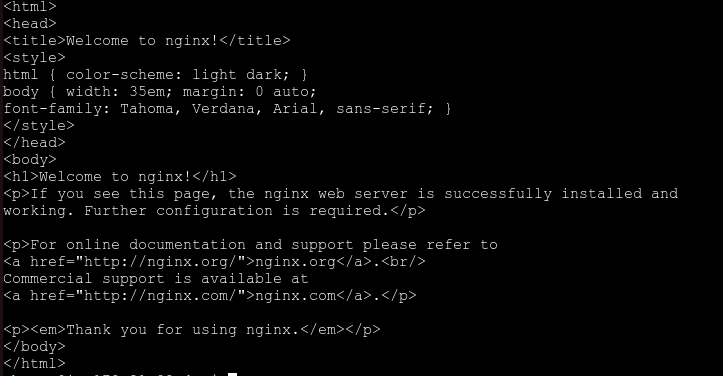

1. **Menginstall Podman :**
    ```bash
    sudo apt-get update
    sudo apt-get -y install podman
2. **Dimana**
    ```bash
    podman pull docker.io/library/nginx

3. **Menjalankan Nginx**
    ```bash
    podman run -d -p 10080:80 nginx

4. **HTTP request**
    ```bash
    curl http:/localhost:10080

4. **Output**
    ```bash
    